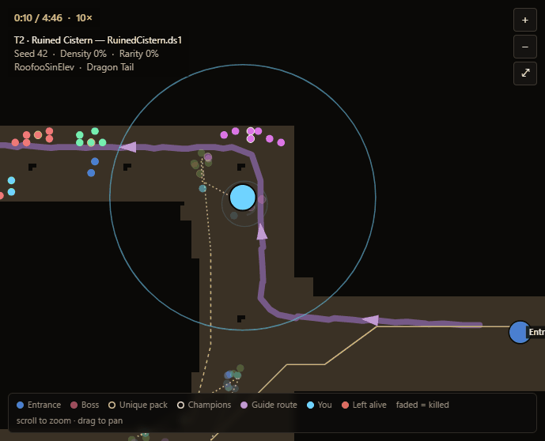

# PD2 Planner

A build planner and map-clear simulator for **Project Diablo 2**, built on the game's own reverse-engineered rules.

**[Features guide, with screenshots](https://roofooevazan.github.io/pd2-planner-releases/)** · **[Download the latest version](https://github.com/RoofooEvazan/pd2-planner-releases/releases/latest)**

- **Character**: load from the PD2 Armory, a `.d2s` save or from scratch; stats, breakpoints, resistances and every skill's damage.
- **Map run**: your build clears a real PD2 map, following hiimpd2.com's pathing guides. Includes each class's movement skill, monster aggro, traps, poison, potions and deaths, and a replay you can record.
- **Batch runs**: the average clear time over many spawns.
- **Map damage**: every monster of a map against your damage (after finpingvin's calculator, on the game's verified resistance rules).
- **Maps, Breakpoints, Patch notes and a game-data browser.**

## Install

Download `PD2 Planner_x.y.z_x64-setup.exe` from the [latest release](https://github.com/RoofooEvazan/pd2-planner-releases/releases/latest) and run it. The app checks for updates once a day (Help → Check for updates) and installs them when you say so.

## Bugs and ideas

Use **Help → Report a bug / Suggest a feature** in the app (it fills in your version), or [open an issue](https://github.com/RoofooEvazan/pd2-planner-releases/issues/new/choose).

This repository holds the releases, the update feed, issues and the features site. The source is kept private.

Diablo II is © Blizzard Entertainment. Project Diablo 2 is the work of its own team; this tool is not affiliated with either.
